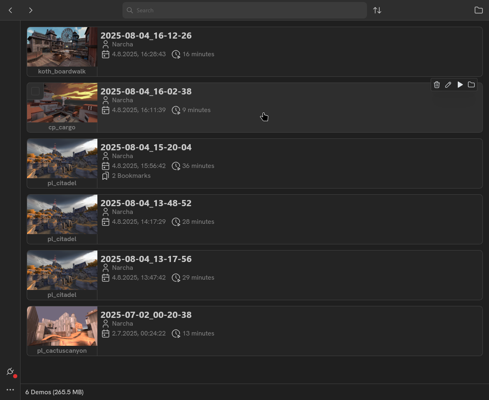
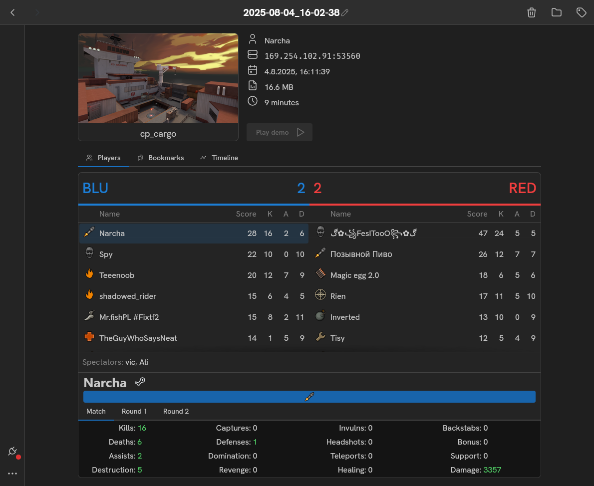
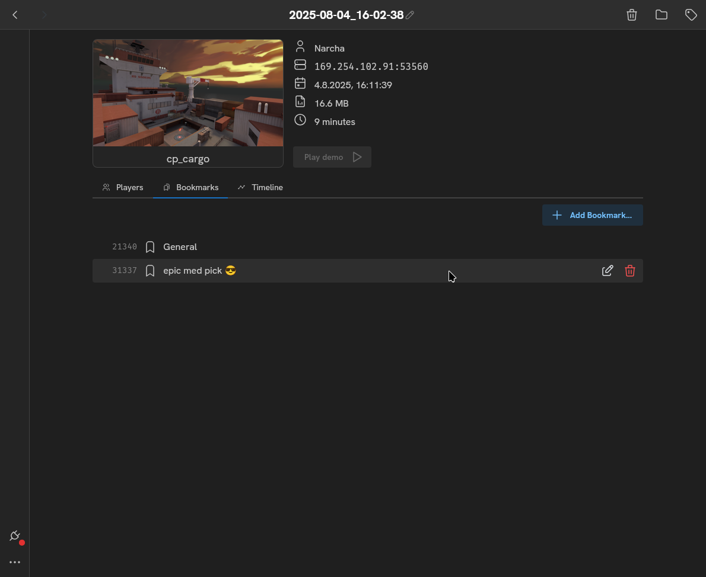
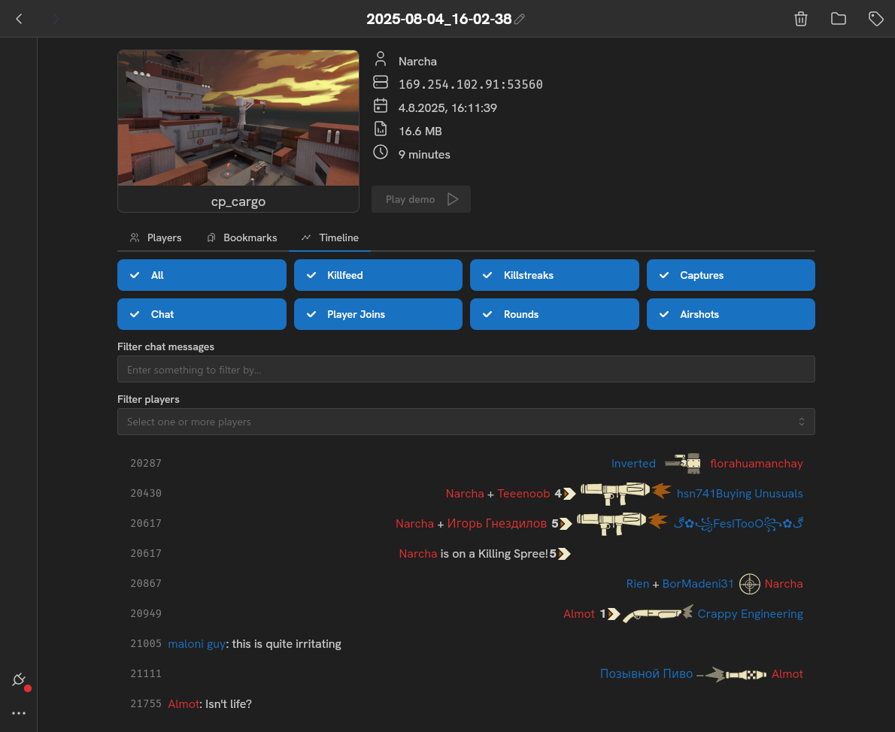

  

  
  
  

The TF2 demo manager for Linux, Windows and MacOS.

# What is a demo manager and why do I need one?

Do you have hundreds of demos lying around, with no convenient way to know what happens in each one?
DemoMan extracts lots of information about your demos, and makes them easily searchable.
It also helps you organize your demos, and allows you to manage bookmarks.

# ✨ Features

- Display/edit bookmarks
- Display events from a demo (chat, killfeed, airshots, ...)
- Display scoreboard, with per-round stats for each player
- Play demo in TF2 with one click
- Organize your demos with tags

# 📸 Screenshots

## Demo List

## Demo Details

### Scoreboard Tab

### Bookmarks Tab

### Events Tab

# ❤️ Contributing

Contributions are welcome and appreciated.
If you have any questions, feel free to chat with the devs
on the project's [Discord server](https://discord.gg/GduKxhYFhR).
Development is organized [here](https://github.com/orgs/DemomanApp/projects/2).

If you can't contribute code, you can still help:

- Give the repo a star on GitHub 😉
- [Contribute map thumbnails](https://github.com/DemomanApp/DemoMan/wiki/Contributing-a-map-thumbnail)
- Report any issues you encounter
- Let the devs know if you have any ideas/suggestions

# 🛠️ Developing

Prerequisites:

- Install Rust and npm.
- Follow [this guide](https://v2.tauri.app/start/prerequisites/) for building tauri apps.

Once that's done:

1. Clone the repository and run `npm install`.
2. Start the program by running `npm run tauri dev`.
3. Create a packaged executable by running `npm run tauri build`.

Before committing, run `npm run check` to run automatic code quality checks.

# ⭐ Acknowledgements

DemoMan would not have been possible without these awesome projects:

- [Rust](https://www.rust-lang.org/)
- [Tauri](https://tauri.app/)
- [Mantine](https://mantine.dev/)
- [demostf/parser](https://codeberg.org/demostf/parser/)

# ⚖️ License

DemoMan is [free software](https://www.gnu.org/philosophy/free-sw.html) released under the [GNU GPLv3](LICENSE.txt) license.
